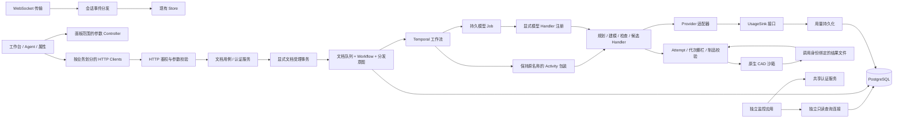

# 解耦后的模块边界

基线为 `62084d5`。采用模块化单体，保留现有部署和事务；没有新增微服务。

## 模块及数据责任

以 `modules.json` 定义公共接口、主要写表和禁止依赖；既有 24 域功能清单继续由仓库共享审查映射维护。这里不建立第二套功能账本。

- 身份：认证、登录节流和角色判断复用同一服务，CAD 与监控保留各自 HTTP 入口。
- 文档：`document_operations` 处理授权和受理；`workflow_admission` 显式组合任务记录、文档队列与重放事件。调用方在同一个事务内持久化分发意图。
- 执行：`run_state` 管理任务、步骤与 Attempt；`model_jobs` 管理模型调用资格；`model_fence` 在事务入口校验资格。受理、提交与终态清理仍有事务边界。
- Agent 与 CAD：Handler 按规划、源代码、原生操作、执行、几何/视觉/DFM、BOM、候选和审核划分。编排名称、参数及 patch 保持兼容。
- Provider：依赖用量接口；生产装配仍使用真实数据库采集，不存在空 Sink。采集的特殊取消后写入只有显式允许的用量模块可以绕过 Job 栅栏。
- 前端：Clients 不依赖 UI/Store。参数编辑明确接收所属面板的持久任务上下文。WebSocket 连接维护与消息业务分发分开，保留现有事件归属和 Store。
- 监控：认证数据库连接与查询连接可分别配置；查询角色不可访问凭据/请求正文或修改数据。`MONITOR_DATABASE_URL` 未配置时维持旧部署兼容，通过只读角色限制查询。

## 兼容入口

`engineeringService.ts`、`api/error_messages.py`、`workflows/model_job_policy.py` 和 `workflows/activities.py` 保留旧导出。业务消费者已迁移到对应模块；工作流包装保留原 Activity 名称。不能只因文件缩短而删除历史入口。

原生修改 DTO 位于 `models/native_modification.py`，HTTP DTO 不再反向依赖 Temporal 提交服务；旧导入位置继续重导出。

## 验证与限制

`check_boundaries.py` 检测 Python 顶层/局部/相对导入及 TypeScript 导入、重导出和动态导入；禁止新增越界和未经允许的栅栏绕过。当前违规基线为空。

它不是完整 SQL/动态调用图证明。跨域授权、事务原子性、代次资格与草稿身份继续依赖真实数据库、Temporal、原生内核及浏览器测试；不得用静态检查替代。

CI 的 `Regression gate` 汇总后端、前端、真实运行时和架构检查。专项 JUnit 缺失、零测试、跳过或失败均不能通过专项证据检查。真实 Provider 凭据不放进仓库：无凭据 CI 运行实际内核和受控 Provider 测试，真实 Provider 验收单列。

## 运行与撤回

无新数据库迁移；当前 head 保持 `0030_model_job_json_numbers`。已增加从 0028 开始、包含排队 Job 与未结束调用的升级测试。撤回本次解耦可恢复旧应用/Worker 构建，不应降级数据库或改写在途任务。

若配置独立监控查询账号，只授予 `cad_agent_monitor` 角色，不授予 `cad_agent_runtime`、`cad_agent_auth`、超级用户或 BYPASSRLS。监控认证仍使用原认证连接；部署凭据通过现有环境机制注入。

GitHub 私有仓库套餐当前不支持分支保护（API 返回 403）。汇总 Gate 配置不等于服务端强制保护；套餐能力解决后，需设为必需检查并要求独立审查，再用失败 PR 验证无法合并。
