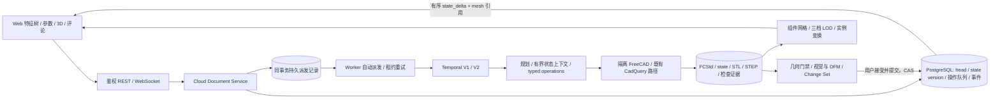

# 云文档：实现与调用链

核对日期：2026-09-09。面向后续开发与交接，依据实际源码及真实服务验收。本文涵盖原 P0 及后续协作、实例场景、分支、草图和工程流程扩展；早期结果保留在 [P0 验收报告](qa/cloud-document-p0.md)。

## 文档事实来源

一个 `CloudDocument` 对应已有项目分支，`document_id == branch_id`。复用现有租户、项目、Revision、Change Set、Temporal 和 Artifact；不引入第二套版本管理。

- 分支 head 是唯一已提交版本。候选可预览，只有已有审查/提交 CAS 能推进 head。
- migration `0013` 的数据库触发器在推进/回退 head 的同一事务中递增 `state_version`，写入文档事件。回退到相同 revision 也不会复用旧 state version。
- `document_checkpoints` 缓存由 SHA-256/字节数验证过的不可变 state 产物派生的投影。它不能替代 FCStd，也不能独立重建导入模型。
- `0014`–`0015` 增加单次审阅邀请、租户外键、操作终态关联，以及 checkpoint/事件/评论的不可变约束。`0016`–`0024` 依次扩展持久派发、标注、租约、编辑邀请、场景缓存、分支、工程任务、发布和本地交付。新增租户表强制 RLS；派发器仅获得派发表所需的专用角色权限。

## 修改与恢复

所有公开 CAD 写入口继续经过 Durable submission。创建 WorkflowRun 与 `cad_operations` 是同一数据库事务；同一文档一次只有一个运行中的内核工作流，其他操作按入队顺序等待。规划、确认、执行与验证也包含在这个串行范围内。候选成为可审查状态后释放执行位，审查与提交仍使用原有 CAS。

新文档操作接口要求 `expected_base_revision_id`、`expected_state_version` 和幂等键。旧接口保留兼容字段，服务端在入队时绑定当前状态；浏览器发送所观察到的已提交 revision/state version。结构化参数更新可以显式允许 rebase：服务端比较目标及依赖的完整参数、原生几何指纹、约束和变换，只有证明未受其他修改影响时，才在最新 FCStd 上重新执行、验证和审查。缺失证据、同参数修改或依赖变化均返回冲突。

FreeCAD 在每个隔离任务中打开基础 FCStd，执行 allowlist，重算、检查、事务提交或回滚，再保存新产物。没有驻留内核会话池。参数更新直接由已验证参数表编译成 `property.set`，不会调用 LLM 重写整个模型。

FCStd 的操作账本会保留历史操作 ID。本轮将新的修改 ID 绑定基础 state 与操作内容，支持连续修改及改回旧值；同一已持久化计划的重试仍使用原 ID。中断处理区分用户取消与 Temporal 超时/Worker 中断；过期尝试的清理不能终止新尝试的步骤。

工作流、文档操作与 `workflow_dispatches` 在同一事务持久化。Worker 后台派发器使用 `SKIP LOCKED`、有期限的租约和失败退避自动补发；Temporal 使用固定工作流 ID 拒绝重复执行。API 在数据库提交后中断也不需要依赖用户再次提交才能恢复。队列领取和执行仍重新检查权限，提交仍检查分支 CAS。

## 语义状态与浏览器

`semantic_state.py` 从实际内核对象、`OutList`、参数、草图求解结果与形体有效性生成特征图。特征 ID 由文档谱系 ID 与内核对象名称确定，受支持的参数操作和分支继承保持该 ID。对外部手工重命名/复用对象名，尚未提供独立身份迁移。

Agent 默认使用有界 L0/L1 上下文：最多 80 个目录对象、默认最后 16 个对象的详情，显式目标及直接依赖最多 32 个对象，每个最多 24 个参数；超过范围明确报告省略数量。完整内核状态仍在可信服务中用于编译和验证。

`role`、`intent` 由用户显式填写，通过独立不可变版本、作者、源修订和 CAS 保存；没有来源时为 `null`，不会从名称猜测。Agent 入队时冻结标注上下文。浏览器和 Agent 可以查询 SHA-256 验证后的内核检查点详情：每次最多 8 个对象、5 类字段、每类 32 项，条目数据预算 16,000 字节；未记录的详情明确返回 `unavailable`。Agent 修改已有模型前必须检查相关对象，最多 3 次有真实 provider 记录的查询。读取已记录详情不创建 FreeCAD 任务。实际 typed 调用使用验证后的内核名/参数 ID，不照抄方案中的 `target.feature_id` 示例格式。

浏览器首次连接/重连读取 JSON snapshot，随后严格按事件序号、基础 revision/state version 应用特征差量。丢事件会触发重连重取 snapshot，不静默跳过。场景由验证后的 FCStd 在隔离内核中生成，保存各最终实体/实例的变换及三档实际 STL tessellation；缓存按项目、运行时 digest 和几何哈希隔离。浏览器保留 WebGL canvas，仅下载发生改变或尚未缓存的组件网格，实例平移复用几何。这里采用组件级替换和实例更新，没有实现顶点级二进制差分。

相机、旋转和特征选择在浏览器完成。参数表显示已提交状态。旧任务结果可审查，但不会替换已提交文档状态。WebGL 不可用时显示明确原因。

## 协作、分支与草图

拥有成员管理权限的账号可创建 24 小时有效、仅供一个登录账号接受的 viewer 或 editor 项目邀请。token 只存散列，经 URL fragment 传入并在接受后清除。受邀账号只获得相应项目角色及普通 tenant membership。编辑者可以提交候选修改，接受并提交版本需要所有者或管理员权限。

共享页面可查看模型、选特征、评论；服务端拒绝 viewer 几何写入和原生文件导出。评论绑定具体 revision，可绑定特征 ID。在线心跳每 15 秒发送，45 秒后不再显示。项目/租户授权撤销后，已持有上下文的流也不能继续读取；已使用邀请不能恢复被撤销的授权，排队操作取得执行位时会重新检查工作区成员资格。

特征编辑租约有效期 90 秒，续约绑定原 token、客户端、账号及修订；过期 token 不能恢复。依赖图判断读写冲突，独立特征可以同时保留草稿。降级或撤销成员时清除相关租约，浏览器同步更新权限。这里没有通用 CRDT；实际几何执行保持文档串行。

分支复用现有 branch/revision。创建分支会重新打开原生检查点并经过检查、审查和提交，保留谱系特征 ID 与源标注。语义比较展示参数、依赖、实例和结构变化；只有可证明的共同祖先与独立参数修改可以自动生成合并候选。同参数冲突和不支持的结构合并明确拒绝。用户可选择审查后完整采用源分支几何，目标分支的标注仍保留。

草图预览使用已测量的圆/线和直接尺寸，在浏览器本地响应指针移动；提交时将尺寸转换为受支持的原生 Radius/DistanceX/DistanceY 等约束操作，由 FreeCAD 最终求解。过约束、无解或未记录的几何不会假成功。显式约束修改失败时不让 Agent 自动改写用户尺寸，文档 head 与已有 FCStd 保持不变。

当前列表上限：最近 50 条操作、100 条评论、100 个在线会话。WebSocket 在后端每秒检查文档事件/协作状态；没有将这一实现描述成大型协作系统的推送性能方案。

## 主要接口

| 方法/路径（前缀 `/api/documents/{id}`） | 行为 |
| --- | --- |
| `GET /` | 已提交文档、特征、参数、mesh 引用、权限 |
| `GET /events?after=N` | 最多 100 条有序事件 |
| `WS /stream` | snapshot、state delta、协作快照 |
| `POST /operations` | 生成、修改、结构化参数更新；返回真实工作流 ID |
| `GET /artifacts/{artifact_id}` | 验证权限、字节数和 SHA-256 后读取产物 |
| `GET /collaboration` | 操作日志、评论、在线状态 |
| `POST /presence`、`POST /comments` | 心跳、幂等评论 |
| `POST /invitations`、`POST /invitations/accept` | 创建/接受审阅授权 |
| `GET /members`、`PATCH/DELETE /members/{member_id}` | 成员列表、编辑/审阅角色调整及撤销 |
| `PUT /features/{feature_id}/annotation`、`POST /inspect` | 版本化意图标注、有界内核详情查询 |
| `POST /leases`、`DELETE /leases/{token}` | 领取/续约和释放特征租约 |
| `GET /scenes/{revision_id}`、`GET /scenes/{revision_id}/meshes/{sha256}` | 组件场景与鉴权、校验过的 LOD 网格 |
| `GET/POST /branches`、`GET /compare/{source_document_id}`、`POST /merges` | 分支创建、语义比较和审查合并 |
| `GET/POST /engineering`、`GET /engineering/{workflow_id}` | 修订绑定的实际有限元和外轮廓加工 |
| `GET/POST /releases`、`GET /releases/{release_id}` | 命名发布、原生 BOM 与工程证据导出 |

鉴权复用已有会话。WebSocket 新客户端通过子协议携带认证，避免把 token 写入 URL；跨账号工作区必须已有授权，知道 tenant/document ID 不构成访问权。

工程计算与 Agent 证据绑定见 [工程计算](engineering-compute.md)；发布、Bridge 配对、交付及权限见 [发布与本地交付](releases-and-local-bridge.md)。运行入口见 [开发文档](development.md) 和 [部署文档](../DEPLOY.md)。
