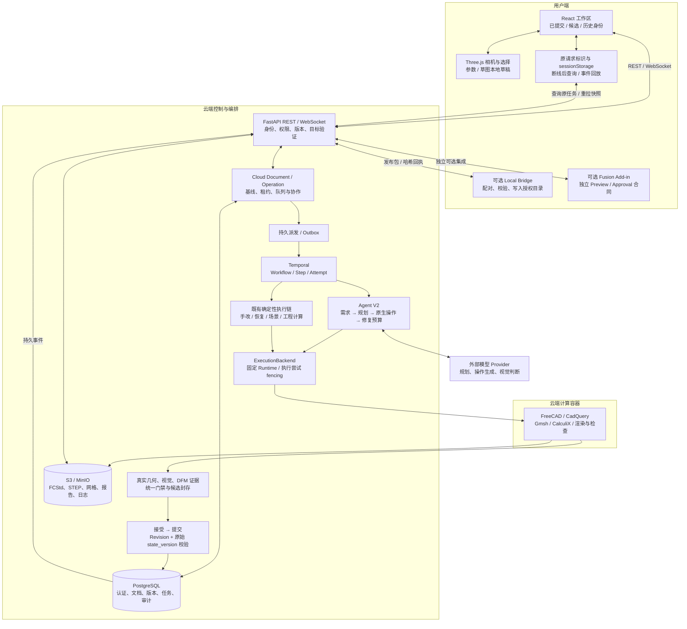

# 新版原生 MCAD 共同编辑实施与验证报告

核对日期：2026-09-13。受众：产品、研发、验收与运维。

本轮已在现有系统中接入 P0 共同编辑能力和 P1 编辑、场景及工程状态改进，并执行真实 PostgreSQL、Temporal、对象存储、FreeCAD 和浏览器验证。**整体验收尚未关闭**：真实模型服务返回额度不足，剩余 Provider 专项受阻；最终 Git 提交的完整 GitHub CI 尚未执行。下文区分功能实现、实际通过的场景和不能确认的范围，不以本地测试数替代整体验收。

## 1. 输入、基线与范围对比

| 输入 | 本轮处理 |
| --- | --- |
| 最新 `CAD-Agent_产品与研发实施方案.html` | 完整读取；本轮产品与研发目标。SHA-256：`06c7d97937040d301a609e4bfdfe06417d46e8b99a409d6aa5a2561317a722f1` |
| 旧 `AI_Native_CAD.html` | 完整读取并对比；其旧源码背景不能代替当前实现。SHA-256：`aa3d0477243dad31719ca972cf402b467eed7de1ac47b91282af8aa8d73a8bcd` |
| 现有代码 | 起始 HEAD：`b292608c68d3f06d6b47c41bd0ad5da8c212d073`；工作分支：`codex/native-coedit-20260912` |
| 既往验收 | 结合 2026-09-09 独立验收及 [2026-09-10 整改记录](acceptance-remediation-2026-09-10.md) 核对；历史报告的整体完成结论不沿用 |

| 变化类型 | 旧方案与新版差异 | 实际采用 |
| --- | --- | --- |
| 新增 | P01–P06 页面行为、统一视图身份、草稿离开保护、固定版本的 AI 目标、应用修改的部分失败处理、一特征多孔消歧、T16–T19 | 在现有工作区、请求合同、Change Set 和任务链内补齐 |
| 修改 | 旧方案把 Cloud Document、Operation Log、原生状态等作为新增基础设施 | 当前代码已具备这些基础，直接扩展；未再建文档或任务平台 |
| 修改 | 历史恢复由未来独立开发改为复用已有同面板 FCStd 恢复 | 沿用 `restore_revision`，补齐查看、候选、提交和回退的身份与守卫 |
| 优先级提高 | B01 核心视图、B04 核心目标进入 P0，要求同一模型手改后继续 AI 修改 | 先修最终提交和验证政策，再接前端共同编辑，真实模型闭环实测 |
| 删除本期任务 / 暂缓 | B10 大范围拆分、完整 Web CAD、通用 Undo/Redo、任意拓扑选择、通用几何合并 | 未新增占位按钮或未接通的后台实体；保留明确能力边界 |
| 冻结扩张 | FEA、CAM、BOM、发布、Bridge 已有能力保留，暂不扩成完整工程套件或设备控制平台 | 修复视图与历史证据归属，执行现有工程与本地文件交付回归 |
| 发布条件分层 | 受控内测与公开多租户区分 | 本轮不把 Compose、鉴权和本地测试通过等同于公开上线就绪 |

关键取舍：`state_version` 是 Head 的推进代次，历史修订号是另一概念；回退到相同 Revision 也必须使旧代次候选失效。FreeCAD 的实际 `Group` 表示容器关系，依赖边不能冒充父子关系。原生孔可由 Hole 或 Pocket 表达，验收按可测几何和稳定特征身份判断，不硬编码模型生成器必须选择某个名字。

## 2. 当前架构与完整调用链



浏览器负责相机、选择反馈与草稿预览。确认后的 CAD 变更进入已有任务链，云端原生内核决定最终几何。AI 与人工共享文档、版本、候选和提交入口；AI 不能自行推进 Head。任务成功表示候选已生成，通过接受与提交后才成为当前模型。

场景构建已经进入已有 Temporal 检查任务和执行后端，第一次读取返回 202，完成后的缓存读取返回 200；场景任务不占建模修改队列、不推进 Head。**这只覆盖 scene 路径**：其他 API 触发的能力执行、原生查询和运行时探测仍需按公开上线门禁逐项审计，不能现在直接移除 API 的宿主 socket。

## 3. 开发进度：起始状态与本轮结果

| 工作包 | 开发前代码状态 | 本轮实现与依据 | 当前完成度 |
| --- | --- | --- | --- |
| A01 验收基础 | 部分完成；GitHub 原生集成阶段因磁盘不足未执行 | 保留全部集成阶段，清理托管 CI runner 中间构建缓存；本地独立数据库、bucket、队列、账号、浏览器入口；正式镜像构建 | 部分完成：本地验证通过项见下表；最终提交 CI 未执行 |
| A02 提交守卫 | 入队有双版本，最终 CAS 只比较 Revision，存在 ABA 缺口 | `change_sets.base_state_version` 不可变；最终同时校验原始代次；文档→分支→候选锁顺序；合并来源也锁定双版本；旧代次不能确认时拒绝 | 已实现并通过 PG / API / 浏览器回退反例 |
| A03 验证政策 | 验证逻辑分散，手改精确值保护已有 | `validation/gate_policy.py` 被 Workflow、seal、review 共用；必需证据非通过、缺证据及明确视觉失败阻断；审查/提交重新核验真实对象长度和 SHA | 已实现；控制负例通过，剩余真实 Provider 修复专项 blocked |
| B01 视图身份 | 3D、属性、检查、文件可能读取不同来源；首模意图依据 `result.success` | 新增修订查询，统一 `useDocumentView` 与 adapter；已提交、候选、历史明确分离；历史只读；旧异步响应和旧网格不污染新版本 | 已实现并通过主流程、历史切换及导出验证 |
| B03 精确手改 | typed 参数与草图已有；提交后立即清草稿、默认 rebase | 草稿 registry、离开确认、浏览器关闭保护；保留原基线、租约和幂等键；默认禁止自动 rebase；确定性内核失败保留输入 | 已实现并通过参数、草图、不可解与不可能圆角实测 |
| B04 AI 目标 | 选中状态只服务前端和 presence，未进入请求语义 | 版本化 `SelectionContextV1`；REST/WS 校验、服务端冻结、Provider 上下文与哈希追溯；限制特征作用域；子元素含混时拒绝 | 已实现并通过真实 Provider 续改与多孔负例 |
| B06 同面板恢复 | 同面板 FCStd 恢复已有，视图与状态提示未对齐 | 沿用已有链创建新候选，展示来源版本；接受/提交分步处理；非当前提交不能回退；回退之后旧候选仍失效 | 已实现并通过真实恢复、断线和回退测试 |
| A06 恢复与联调 | Outbox、Attempt、事件回放已有；缺首轮 ACK 丢失恢复闭环 | 根据原用户/session/panel/幂等键只读查询；刷新后先对账，再决定是否重传；接受后提交失败保留同候选；终态回执清理待确认请求 | 已实现；故障矩阵已测，整批关闭仍依赖 A01 和真实 Provider 剩余项 |
| B02 层级 | 列表、依赖与特征信息已有 | projector 4 读取真实 Group 顺序、类别和 Body Tip；层级与依赖分开；旧投影退回列表；不改变历史证据和内容指纹 | 已实现并通过内核与旧投影升级回归 |
| B05 受限选择 | 组件选择和部分物理绑定已有 | 相机旋转不会误触选择；无独立网格时明确说明无法单独高亮；不把父特征选择冒充某个子孔或任意面选择 | 已实现到新版受限范围 |
| B07 分支风险 | 分支、独立参数 rebase、受限合并已有 | 比较结果冻结来源和目标 Revision/代次；双侧过期禁合并；明确刷新；防止迟到比较结果覆盖 | 已实现并通过实际双分支修改、合并和两侧 ABA 提示 |
| A04 / B08 scene | 同步 API 内核执行，已有缓存和 LOD | 迁移 0027；原生修订、源文件 SHA、runtime/schema 固定；并发只创建一个逻辑任务；取消、撤权、显式重试；复用原任务与制品体系 | scene 部分已实现并通过；全部 API 执行隔离仍未完成 |
| B09 工程状态 | 原生 FEA/CAM 与修订证据已有 | 历史、其他版本报告标记；当前流程按真正已提交版本判断；下载按 `can_export`；旧报告不验证当前模型 | 已实现；FEA、CAM、历史切换、撤权与发布回归已测 |
| A05 公开上线 | 当前 Compose 仍共享主机执行与凭据 | 本轮补测真实撤权和 MCAD 数据/对象联合恢复；保留现有权限边界 | 部分完成；专用执行节点/凭据、配额及全部 API 脱离宿主执行尚未完成 |
| B10 / C01 等 | 暂不排期 | 未做无关重构、完整 Web CAD、任意几何合并或完整离线编辑 | 不在本轮交付范围 |

数据库追加迁移 `0026_change_set_base_generation`、`0027_document_scene_tasks`，没有改写已经应用的迁移。0026 只恢复可追溯的旧候选基线，无法证明的保持 NULL 并阻断应用；不会用迁移时的最新代次伪造原始基线。0027 的 scene 来源、权限归属与请求身份保持不可变，启用 RLS。

## 4. 真实同模型共同编辑结果

主文档 `873e7484-53db-4227-bee8-06989d753216`，实际执行自然语言生成 60 × 40 × 8 mm 板、中心 Ø6 通孔；HTTP 人工修改到 Ø8，浏览器手改到 Ø9 并提交。随后在该模型上选择 Pad，让真实 Provider 增加厚度；最终共同编辑验收版本为：

| 事实 | 结果 |
| --- | --- |
| AI 续改任务 | `a705e2ee-fff1-460f-9473-e6d7b110343f` |
| 候选 / 提交 | Change Set `63d0718d-99f9-45f0-a016-9b1ee58ecaee`；Revision `e767ae0a-f7af-4ef7-a7ff-c96fc132830c`；代次 14 |
| Provider 输入 | 实际 Moonshot / `kimi-k2.7-code`；上下文读取代次 13 的 16 mm Pad 与 Ø9 Hole，选择对象及原生上下文 SHA 一致 |
| 原生独立检查 | 分别重开下载的 FCStd 与 STEP：60 × 40 × 18 mm，中心坐标相对模型边界为 (30, 20)，Ø9 通孔，深度 18 mm |
| 体积 | FCStd / STEP 均为约 `42054.88947776652 mm³` |
| 保留约束 | 人工 Ø9 参数未被 AI 重置，原特征 ID、Body Tip 与层级保持 |
| 浏览器 | 真实选择、草稿、审查提交、刷新与只读身份通过；页面 JS 错误 0 |

此后 B09 历史工程报告测试又实际将 Pad 改为 18.25 mm 并提交，故当前测试文档 Head 是 `dad82305-424f-4316-8a2b-41adbbebdf62`、代次 15。该变更用于验证旧 18 mm 报告不会表示 18.25 mm 新几何已验证，不能混作上表共同编辑版本。

另一个真实一 Hole 四轮廓文档为 `b8a7ebb1-7ea0-40b3-9e1b-462b2c49815e`。六类含混或非法选择全部在入队前返回 422，新增建模任务为 0；明确要求整体修改四孔后，真实 Provider 任务 `249d549c-f69a-4ad4-9d97-2b46c97a61a2` 提交到 `69dc8763-7686-43ad-a631-a4f39dbd6105`。独立 FCStd/STEP 测量确认四个 Ø8 通孔，深度 8 mm，位置相对边界为 (30,20)、(15,10)、(45,10)、(15,30)，体积约 `17591.50456136202 mm³`。

## 5. T01–T19 验收矩阵

状态只使用 `passed / failed / blocked / not_run`。下表的 passed 是列明场景在本轮实际执行的结果，不表示未提交工作区已取得“最终提交同 SHA 全量验收”。覆盖层次不足或额外外部依赖均在限制列说明。

证据根目录记作 `$E=/private/tmp/cad-coedit-20260912`；`live/` 是当前隔离 E2E 的文件夹。账号、原始 trace、模型及备份留在私有目录。[证据索引](evidence/native-coedit-2026-09-13/index.json)记录 81 份原始证据的路径、长度和 SHA，并收录 15 份可随仓库查看的结果与来源记录。控制成功与真实 Provider 成功、原失败和复验结果均分开保存。

| 用例 | 状态 | 实际验证与主要证据 | 限制 |
| --- | --- | --- | --- |
| T01 干净基础栈 / Runtime | blocked | 正式后端、前端、沙箱镜像构建；真实固定 Runtime 探测；独立数据库迁移与隔离服务 | 尚无最终提交的 GitHub CI；完整依赖全部新建、同 SHA 真实 Provider 浏览器验收未闭合 |
| T02 真实生成并应用 | passed | `live/http-v2.log`、`live/browser-v2.log`；真实自然语言尺寸和孔语义，候选不提前推进 Head；独立几何见 `live/coedit-selection-final-v2/independent-geometry-v2.log` | 本轮完成版本见 §4 |
| T03 手改后 AI 续改 | passed | `live/coedit-selection-final-v2.log`、`live/coedit-selection-final-v2/provider-provenance.log`；手改 Ø9 后 AI 改 Pad，读取新基线，保留孔参数和身份 | 真实模型额度耗尽前完成 |
| T04 草图 / 精确失败 | passed | `live/b03-sketch-browser-v3.log`：50 次 pointer move、0 次内核执行，确认后真求解；不可解三角形显式失败；`live/t04-exact-radius.log`：人工 4.5 mm 圆角失败，输入与原 0.5 mm 模型保留，无 AI 重设计 | 受限、已有约束草图；不是完整 Sketcher |
| T05 回退 ABA / 并发 | passed | `a02-generation-migration.log`、PG 集成、`live/recovery-browser-v5.log`：同 Revision 旧代次被 409 拒绝，并发最多一个推进 | 旧代次无法追溯时拒绝，不猜测补值 |
| T06 Rebase / 双分支合并 | passed | `live/t12-collaboration-http-v2.log`、`live/b07-merge-http.log`、`live/b07-branch-browser-v2.log`：独立参数真重放、同参数/依赖冲突、来源及目标过期阻断 | 仅可证明独立的参数，不支持任意几何合并 |
| T07 响应丢失 / 刷新 / 事件 | passed | `live/recovery-browser-v5.log`：丢弃一次真实 WS ACK，刷新后查询原键，传输及原生执行各 1 次；`a06-ws-container-regression.log` 覆盖事件回放与缺口 | 未伪造业务响应；普通网络延迟不计新任务 |
| T08 Worker 中断 / 取消 | passed | `temporal-controls-final-v1.log`：真实 Worker 进程崩溃后的 fencing 与新 Attempt；`live/t08-provider-cancel.log`：0.753 s 接受取消，20 s 内无迟到候选、Head/文件不变 | 进程控制负例的 Provider 行为按测试显式受控；另有真实 Provider 取消 |
| T09 制品破坏 | passed | `postgres-integration-final.log` 中实际 S3 替换、截断、删除，接受/提交被阻断；accepted 保留，恢复相同字节后可重试 | 没有用其他版本文件替代缺失文件 |
| T10 政策 / 修复预算 | blocked | `t10-native-visual-budget-v5.log` 与最终 Temporal 控制回归：advisory failed、required failed、required indeterminate 三种受控视觉负例 + 真内核、渲染、S3 均通过 | 真实 DFM 修复任务遭 `ProviderQuotaError`，不能记为真实预算耗尽通过；见 §7 |
| T11 选择可靠性 | passed | 原生选择单测、真实运行时、`live/t18-multi-hole.log`；旧版本、对称/测量不完整/虚构目标、越出选中特征作用域均拒绝 | 未提供任意 FaceN 选择；有限已验证 selector 的支持范围明确 |
| T12 权限 / 租约 / 撤权 | passed | `live/t12-collaboration-browser.log`、`live/t12-lease-expiration.log`、`live/t12-native-revocation.log`、`live/t12-engineering-controls.log`、scene controls：真实 90 s 租约、排队撤权 0 执行、下载/审查拒绝、前端即时撤权 | editor 原本就无 commit 权限；撤权后 403 不冒充“原 owner 丧失 commit 权限”的专门测试 |
| T13 同修订并发 scene | passed | `live/scene-async-v4.log`：双账号 20 次请求复用 1 task / 1 step / 1 attempt；三档 LOD 哈希一致，Head/建模队列不变；`live/scene-controls.log` 覆盖取消、撤权、显式 retry | 缓存 7.19–7.79 ms 是本机样本，不是容量或 SLA 承诺 |
| T14 工程限制 / 旧报告 | passed | `live/b09-engineering-http.log`、`live/b09-engineering-browser.log`、`live/b09-cam-browser-v2.log`、`live/b09-historical-fea.log`；真实 FEA/CAM、非法组件/过短刀具拒绝，旧版本报告明确分离 | 当前有限工程范围，真实机床后处理及切削未验收 |
| T15 升级 / 联合恢复 | passed | `live/temporal-replay.log`：4 个实际归档历史回放；`live/t15-joint-restore-v3.log`：新库/新桶 69 表、10,437 行、609 对象核对；16 个原生历史版本通过真实认证下载和 SHA 校验 | 覆盖 MCAD PostgreSQL（含认证）与 S3 当前对象版本；不包含 Temporal 整库恢复、全部旧 VersionId 或 Fusion 本地状态 |
| T16 同面板恢复 / 当前回退 | passed | `live/recovery-browser-v5.log` 创建真实恢复候选、接受/提交后推进；回退原版本后代次增加；`live/t17-view-identity-v2.log` 中非当前提交回退 409 | 不支持任意跨分支恢复 |
| T17 视图 / 迟到响应 / 导出 | passed | `live/t17-view-identity-v2.log` 延迟一次真实历史响应，再切另一个版本；3D/Pad 参数/只读状态/实际 STEP 字节同修订，迟到响应无污染；`packaged/first-candidate.log` 单独验证首候选只读、空 Head 的 generate 意图、应用后才能编辑 | 首候选子场景使用真实确定性原生 fixture；检查意图时扣留一条外发提示，未将该提示算成真实 Provider 语义执行 |
| T18 一特征多孔 | passed | `live/t18-multi-hole.log`、`live/t18-multi-hole-measurements-v2.log`；父特征“这个孔”及选边改整孔被拒；明确整体修改四孔后真 Provider + FCStd/STEP 独立量测 | 无法唯一辨认的单孔目标要求补充，不自动选择邻近孔 |
| T19 接受后提交失败 | passed | `live/recovery-browser-v5.log`：实际接受后中断一次 commit 请求传输，保留 accepted / Head 不变；查询并重试同一候选，仅推进一次 | 保留最初失败请求和成功重试记录 |

## 6. 回归、打包与既有功能保留

### 6.1 自动回归结果

| 检查 | 实际结果 | 证据 |
| --- | --- | --- |
| 后端常规回归：宿主 Python 3.12 | 1,413 passed / 157 skipped / 1 deselected，48.44 s；此后补充 Node 环境测试分支 | `backend-regression-final.log` |
| 后端常规回归：正式镜像 Python 3.11，最新测试 | 1,416 passed / 155 skipped / 1 deselected，79.75 s，0 failures | `backend-packaged-regression-v4.log` |
| 前端测试 | 113 passed / 0 failed / 0 skipped | `frontend-final-tests.log` |
| 前端 lint / TypeScript / Vite 生产构建 | passed | `frontend-final-lint.log`、`frontend-final-build.log` |
| PostgreSQL + 非 Temporal 集成 | 108 passed / 1 skipped，77.08 s | `postgres-integration-final.log` |
| Temporal 全部无额度依赖控制用例 | 20 passed / 4 skipped，258.99 s | `temporal-controls-final-v1.log` |
| 真实原生运行时测试 | 4 passed，88.05 s | `native-runtime-final.log` |
| 0026 旧代次迁移专项 | 1 passed | `a02-generation-migration.log` |
| Workflow replay | 4 passed；旧归档、当前 V1、恢复、scene 历史 | `live/temporal-replay.log` |
| Fusion schema / Python 编译 / shell 语法 | passed | 本轮执行 `generate_schema.py --check`、`compileall`、`bash -n` |
| 正式 Dockerfile 构建 | 后端、前端、沙箱均 passed；沙箱实际 Runtime probe passed | `backend-clean-build.log`、`frontend-clean-build.log`、`sandbox-clean-build.log`、`runtime-built-probe.log` |
| 无源码挂载正式镜像全链 | passed；新库从空迁移至 0027，新 bucket，原生生成/提交，浏览器手改/刷新/提交、场景与文件哈希 | `packaged/start.log`、`packaged/browser.log` |

跳过项不是通过：后端常规回归主动排除真实 Docker/LLM/Fusion 实机条件；PG 集成的 1 项需 `CAD_AGENT_TEST_LLM=1`。Temporal 的 4 个 skipped 分别是实际 Provider 原生正例、真实视觉 Provider、真实修复 Provider，以及真实 planner/retriever/codegen 链。另一次真实 Provider 集成运行已完成生成→修改正例，但整组未通过，不能把它计成“全模块绿色”。

正式镜像回归使用实际安装的 Python 3.11 依赖，只追加 pytest 9.0.2 / pytest-asyncio 1.3.0；源码从构建时的无凭据导出复制到容器内可写目录，并带入后来修正的 `test_history_regression_qa.py`。应用源码仍与 841 文件清单一致。相对宿主结果，多 1 项显式 Node 存在/缺失策略用例，以及在该镜像中能实际运行的 2 项 Chroma 测试，故为 1,416 passed / 155 skipped。此处是常规隔离测试，真实服务/内核/Provider 证据仍按 T01–T19 单列。

不同表中的专项与回归有重叠，**不能相加宣称去重后的总用例数**。前端仍有约 901 KB OrbitControls 相关 chunk 的构建提示，本轮未作无关依赖拆分，也未宣称解决加载容量问题。

### 6.2 工程、发布与本地交付

实际 FEA：6,467 个节点，CalculiX 2.23，最大位移约 `4.53e-5 mm`，最大应力约 `0.847 MPa`，力平衡相对残差约 `2.76e-9`。浏览器完成材料、载荷、结果、位移比例与真实文件下载。参数更新后旧报告被标识为其他版本。

实际 CAM：任务 `ff20719b-4c6f-4e20-87d8-e76074e58186`，7 层刀路、448 段，最小实测间隙约 0.012144 mm；范围明确为 2.5D 外轮廓，内部孔不冒充已加工。下载 NC 的 SHA-256 为 `b8b93001c682350dd1da16a8c4cbc5faba3e51b31fb04e1a10c2217f3842eae6`。过短刀具真实失败。

发布 HTTP 和浏览器流程通过，发布 ID 分别为 `bdabf0a3-cd90-4afe-bd7c-03afb5003ee2`、`6dc75996-1ed0-460b-863c-27bbcb5dd52e`。真实 `Assembly::BomObject`、14 个包文件、7 个工程证据文件的归属与哈希核验通过。可选旧 Agent 工程 fixture 未提供时的子检查没有被计为通过；旧证据拒绝由 B09 专项单列。

Bridge HTTP 通过真实 standalone CLI 配对、14 文件写入、哈希回执、305 s 真实租约过期及第二次领取恢复；旧文件不重写、旧 ACK/配对码重放被拒、viewer/撤权受限。API 容器实际地址变化后代理在 5.279 s 恢复，前端未重启，HTTP 查询参数、已打开浏览器与 session WebSocket 恢复，Head 不变。

Bridge 浏览器首次和第二次运行虽然已交付文件，但后台资源请求出现 PostgreSQL `TooManyConnectionsError`，因此两次运行均记为 failed。缩小本轮连接池仍不足，共享实例 Temporal 占用 62 个空闲连接；建立独立 `cad-coedit-20260913-postgres` 并保留原共享库后，第三次浏览器运行通过，页面与控制台错误均为 0。实际交付 `6621cec9-0426-4075-8726-c3f71fd830cd` 的 14 个文件写入成功，连接随后正常撤销。证据：`live/regression-bridge-browser-v3.log`。

不安全目录负例也通过：真实符号链接目标被拒且目录外 0 写入；修复目录后产生新交付 `fd51ef9b-930f-4dd6-b42a-97ac4bc3cba0` 并成功，原失败 `f349eb69-253a-48bf-b579-15b6b8b43f54` 的记录保持不变。证据：`live/regression-bridge-failure.log`。

### 6.3 当前运行和来源

开发验收入口：`http://127.0.0.1:8100`；API：`http://127.0.0.1:8040`。正式镜像验证入口：`http://127.0.0.1:8101`；API：`http://127.0.0.1:8041`。均为本机隔离测试环境，本轮没有更新腾讯云。

| 项目 | 身份 |
| --- | --- |
| 活跃开发 API / Worker | `cad-coedit-20260913-api` / `cad-coedit-20260913-worker`；源码只读挂载 |
| 活跃开发沙箱 | `localhost/cad-agent-sandbox:coedit-20260913-dev1`；digest `sha256:9d0a86ea27e96960f87430c7320f1ce06fa51dbdabf65fb599aa7da7a911e20c` |
| 正式后端构建 image ID | `5b39aa8ffeeb6aa08aad26be5f6159dcd30b2046167e16b1a2f7cec936b9c8e9` |
| 正式沙箱构建 image ID | `5d2ef7562f629251a609c569ee5848a64d5f7ad07d8b25bf3b7c4f6657b8a443` |
| 正式前端构建 image ID | `feb5e4f5c211762bfb8cf11e49f093f08d149b881a4c3f990be226bf8ecbe2a2` |
| Runtime | Linux arm64；FreeCAD 1.1.3，Runtime lock 由正式探测核验 |
| DB / bucket | `cad_coedit_live_20260913` / `cad-coedit-live-20260913`；测试数据与用户环境分开 |
| 独立 PostgreSQL | `cad-coedit-20260913-postgres`；收尾前把本轮 live 库完整复制至此以排除共享连接容量；原共享库保留 |
| Temporal 队列 | `cad-coedit-live-20260913`、`cad-coedit-live-agent-20260913`；测试模块另用独立后缀队列 |
| 数据库 schema | `0027_document_scene_tasks` |
| 正式构建源清单 | 1,385 文件；manifest SHA-256 `7ec2959bdefa6b32a8b51d92da4f6970041daf8cb38d4ce9394580a956f99387`；打包后另有本报告等文档更新，应用源码未用文档变化冒充新功能测试 |

源清单是未提交工作区的可核验记录，**不是最终 Git commit SHA**。Docker image ID、OCI manifest digest、Git SHA、模型文件 SHA 分别记录，不相互替代。已有用户目录 `.superpowers/` 未纳入本轮发布内容。

[应用文件清单](evidence/native-coedit-2026-09-13/application-manifest.json)包含 841 个实际源码/依赖/运行时输入，逐文件核对与正式构建上下文一致，清单 SHA-256 为 `64642e23dcba952e3c96863bb214bcc352d35729532729c405a18850f01fbf1c`。[正式镜像来源记录](evidence/native-coedit-2026-09-13/packaged-provenance.json)同时保存 OCI digest、运行容器和迁移版本。

无源码挂载验证另外使用 `cad_coedit_packaged_20260913`、`cad-coedit-packaged-20260913` bucket 和专用两条任务队列。任务 `5c08f216-8113-4da0-a6a0-66c7c788bd2d` 在正式沙箱创建两个真实 Body 后提交；浏览器手改任务 `76f4765c-ebf5-4c62-b91c-fad737610893` 将 PadA 从 10 mm 改为 11 mm，PadB 和所有特征 ID 保持不变。提交后 Revision 为 `5ce0140c-5a23-4889-91cd-ba7ed1c9bf49`、代次 2；任务中刷新和提交后刷新、3D 身份、FCStd/state/mesh 实际下载 SHA 全通过，页面与控制台错误为 0。这是确定性原生编辑与正式打包链路验证，没有把它标成真实 LLM 语义验收。

首候选浏览器专项另创建文档 `ba031c68-2771-4ab1-911c-c04038c84386`，真实任务 `b56e0a89-1fc6-4fbd-8902-d49c61c354d4` 成功后 Head 仍为代次 0，候选视图的 Pad 和 Agent 修改按钮禁用。切回空 Head 后真实浏览器生成的请求仍为 `operation_intent=generate`；测试只扣留该外发请求作检查。随后通过真实审查界面应用原候选，提交到 `29b83387-5f89-4afe-bef6-24c9bce22e2b`、代次 1，刷新后参数可编辑、3D 同版本、FCStd 下载哈希正确，页面错误为 0。见 [首候选结果](evidence/native-coedit-2026-09-13/first-candidate.json)。

收尾时两个 API 和两个前端代理的 `/ready` 均返回 200 / ready；[就绪记录](evidence/native-coedit-2026-09-13/readiness.json)明确不把配置/依赖探测当作模型账户有可用额度的证明。文件检查包含 Markdown 本地链接、应用清单一致性及本轮已知凭据/私钥泄露检查；没有把这一有限检查称为完整安全审计。

## 7. 失败、修复与外部阻塞

| 原始问题 | 根因与处理 | 复验结果 |
| --- | --- | --- |
| 旋转 3D 时误选部件 | 点击与旋转的 pointer 位移未区分；使用实际事件位移阈值 | 浏览器相机操作通过 |
| 切新修订时短暂显示旧网格 | mesh 加载完成状态未绑定当前请求的文档/Revision | 绑定双身份后草图与历史切换复验通过 |
| 选一个特征可经依赖改另一特征 | 依赖闭包过宽，混入不属于容器的下游对象 | 只允许真实 Group 成员和适用直接 Sketch；越界反例通过 |
| 选边却修改整个多孔特征直径 | 子元素意图和父特征属性更新未分离 | 拓扑选择限制为明确 fillet/chamfer；多孔非法操作 422、0 入队 |
| 最终提交缺少代次 | 相同 Revision 回退后 ABA 仍能通过 | 0026 与统一锁序后迁移、并发、浏览器反例通过 |
| 一次常规回归 6 failed / 107 errors | 测试启动缺 `APP_ENVIRONMENT=test`，触发真实生产配置防护 | 按现有 CI 的测试配置复跑 1,413 passed；没有削弱应用防护 |
| 宿主 WS/S3 回归 36 passed / 1 failed / 1 teardown error | 宿主与 Podman VM 时钟相差约 33 分钟，S3 返回 `RequestTimeTooSkewed` | 在 VM 同钟容器环境复跑 37 passed；没有关闭 S3 校验 |
| PG 回归及 Bridge 500 | 多个旧环境共享 max_connections=100；前者连接池限制后通过，后者仍有瞬时耗尽 | 完整 PG 回归 108 passed；Bridge 转独立实例后第三次浏览器回归 passed、0 页面/控制台错误 |
| Provider 正例检查固定 `Hole` 名称失败 | 真实生成可命名为 `hole_main`，也可用 Pocket 形成真实孔 | 测试改为实际特征类型/身份，加严孔径、位置、体积、倒角测量；真实生成→修改正例通过 |
| 预算测试要求每步只能有 Attempt 1 | 一次真实内核 heartbeat timeout 后按协议创建 Attempt 2；旧尝试已经终态 | 测试按 fencing 语义检查每逻辑步恰有一个成功且为最新尝试，保留精确业务修复预算；最终控制回归 20 passed |
| 恢复脚本初版误认认证 SQLite | 只看了 legacy 分支；实际 `DURABLE_CONTROL_PLANE_ENABLED=true` 时认证使用 PostgreSQL | 修正为 PG 认证表、现有 token 与密码登录实测，联合恢复 v3 passed |
| 测试脚本定位、路径或测量入参错误 | 重复按钮、错误 tab、容器 working directory、遗漏 `PYTHONPATH` / `CAD_HOLE_MEASUREMENTS` | 修正 harness 后独立新运行复验；原日志保留，不修改失败为成功 |
| 打包依赖回归首轮 7 failed / 107 errors | 测试模式需要写 legacy SQLite，直接只读挂载整个工作区阻断 fixture；另有宿主 Node 假设 | 使用容器内可写、无凭据代码导出。实际 Durable 部署认证继续按 PG 事实记录 |
| 打包依赖回归第二轮被终止 | 4 GB VM 中额外运行两组 API/Worker 和遗留失败测试进程，退出码 137；没有得到完整汇总 | 停止仅本轮隔离 API/Worker 和已失败测试进程释放内存，最终完整运行通过后恢复全部本轮服务 |
| 打包依赖回归第三轮 1 failed | 旧 catalog 单测默认 PATH 中存在 Node；正式 API 镜像正确把可选 standalone viewer 标为 blocked | 显式覆盖有/无 Node 两种依赖状态，7 项模块回归通过；正式镜像第四轮 1,416 passed / 155 skipped / 0 failed |

真实 Provider 的明确阻塞如下：

- `temporal-full-final-v4.log` 的首个真实 Provider 请求返回额度不足，配置为 Moonshot / `kimi-k2.7-code`。
- 真实 DFM 任务 `c7951172-0b24-48ce-bbbc-4425d76c1cc2` 曾完成首轮 geometry/visual、DFM failed、一次真实 repair、第二轮 geometry；随后 visual failed，继续修复时返回 `ProviderQuotaError`。这证明了执行事实，**没有证明 DFM 预算耗尽用例通过**。
- 浏览器重新打开上述失败任务，真实显示 Provider 失败；无可审查候选、0 FCStd、Head 代次 0、无 JS 错误。该失败呈现测试通过，只能证明错误与版本隔离。
- 等待原服务补充额度或提供已授权可用的替代配置后，才能继续真实修复/视觉/规划链专项和最终同提交完整验收。没有用假 Provider 成功替代这些结果。

## 8. 复验入口与未完成事项

测试入口及环境变量详见 [E2E README](../../backend/tests/e2e/README.md)。基础命令：

```bash
# 后端常规回归；真实 PG/E2E 配置不能混入这组 fixture。
cd backend
APP_ENVIRONMENT=test DURABLE_CONTROL_PLANE_ENABLED=false \
  CAD_AGENT_TEST_DATABASE_URL='' python -m pytest \
  -m 'not docker and not llm and not fusion_e2e' -q -rs

# 前端
cd ../frontend
npm run lint
node --test --experimental-strip-types tests/*.test.ts
npm run build

# 合同与脚本
cd ..
python scripts/fusion360/generate_schema.py --check
python -m compileall -q backend/app backend/alembic backend/tests/e2e fusion_addin/CADAgentFusionConnector scripts/fusion360
git diff --check
```

真实 PostgreSQL/Temporal/S3 测试在配置好的隔离 VM 容器中执行；repo 挂载为 `/app`，镜像工作目录是 `/app/backend`，pytest 路径为 `tests/...`。`DATABASE_POOL_SIZE=4`、`DATABASE_MAX_OVERFLOW=0` 用于限制测试连接，不能通过停用 RLS、完整性或 required gate 获取通过。独立原生测试用 `RUN_REAL_FREECAD=1`；未提供模型、Docker 或桌面条件时如实 skipped / blocked。

后续必须完成：

1. 恢复真实 Provider 可用额度，完成 T10 的真实修复效果及被跳过的 Provider 专项；若外部服务出现新的失败，先定位并修复，再重新验收。
2. 对最终提交记录 Git SHA、镜像 digest、迁移、基线与产物，执行完整 GitHub CI 和相同提交的真实浏览器/Provider 闭环。当前本地结果不能代替该门禁。
3. 若进入公开多租户发布：完成所有 API 直接计算入口迁移，随后移除 API 宿主 socket；验证专用执行凭据/节点、撤权、配额、备份运行制度与故障恢复。当前单机隔离容器与一次恢复演练不能替代这些条件。
4. Fusion 360 Windows/macOS 实机、真实 CNC/打印/机器人设备、生产网络和腾讯云最新代码部署不在本轮已验证范围。既有合同回归不表示这些外部目标已接通。

当前可执行的本地回归及打包验证已完成；真实 Provider 与最终提交验收的阻塞继续保留，不能以“代码已经写完”宣布新版方案全部通过。
