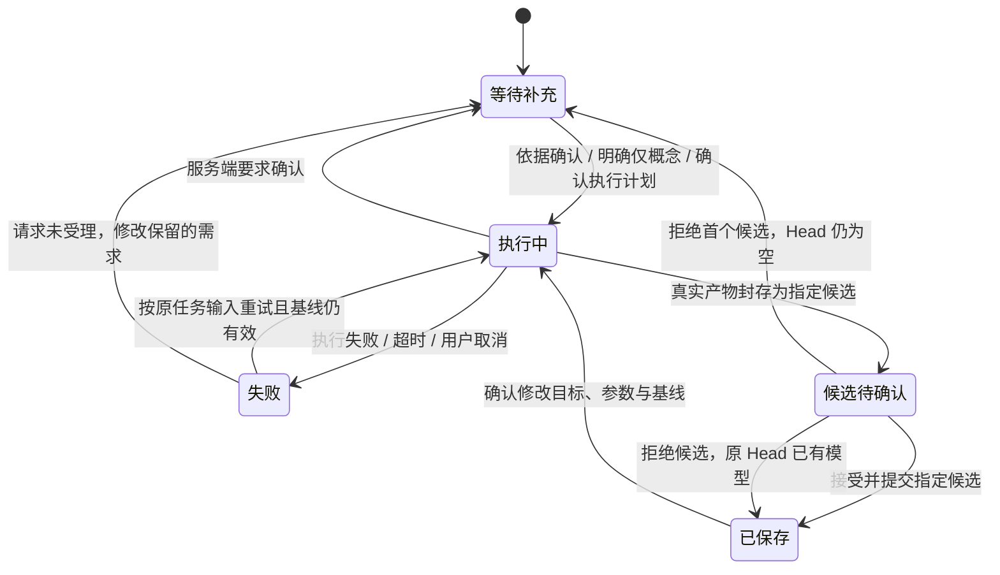

# 五状态与手机壳反馈整改报告

日期：2026-09-13。基线：`954a7de`。本轮以用户要求的五种状态为核心，保留四区布局、配色、模型、Agent 和独立属性区。依据为实际源码、真实服务和浏览器操作，不把手机外形当作适配验证。

## 五种状态与操作闭环

| 状态 | Agent | 模型视口与检查器 | 下一步 |
| --- | --- | --- | --- |
| 等待补充 | 确认目标、用途、尺寸来源、制造设置；或等待服务端计划确认 | 没有执行动画；已有版本可继续查看 | 补充关键依据、确认仅概念、确认/拒绝计划 |
| 执行中 | 首次生成、修改模型或校验模型；具体服务端步骤与已记录结果 | 视口不再放大面积“重新计算”浮层 | 取消；手动修改可保留草稿 |
| 失败 | 人类可读错误、保留原需求，调用详情折叠 | 停止执行动画，保留上一个有效版本 | 原任务重试；参数/版本任务返回相应入口；故障摘要交管理员 |
| 候选待确认 | 明确候选未保存；检查与适配分别说明 | 预览指定候选，属性只读，原 Head 不变 | 审阅参数/特征变化，接受并提交、拒绝，或回到已保存版本修改 |
| 已保存 | 已提交为当前版本 | 特征与属性默认展示；导出按实际产物和权限启用 | 选特征改参数或向 Agent 发出同对象修改请求 |

受理结果未知时属于等待核对，文案为“等待确认任务是否受理”，通过已有幂等恢复入口查询原请求，不断言建模未执行。顶部“文档已同步”仅表示文档同步事实。

## 本次完成

1. **权威任务状态。** `taskState` 从当前任务、实际 Head 和候选审查状态统一投影，Agent、项目流程、视口和检查器引用同一事实。终态优先于旧步骤/旧确认；旧工作流不能覆盖重试。明确拒绝提交后停止等待，未知受理结果保留幂等恢复流程。
2. **可执行的失败恢复。** 额度错误为“模型服务额度不足，本次未生成模型”；主卡不反复输出 `ProviderQuotaError`。显式重试复制原需求、工程依据、选中对象、制造配置和基线，重新验证权限与版本；“继续”在失败时触发恢复。参数和版本恢复不重用过期租约。管理员入口提供可复制故障摘要；没有伪造自动通知或联系方式。
3. **执行前工程依据。** 显示已确认条件、用途、尺寸来源、制造设置及缺失开孔/装配依据。无来源时要求确认“概念外形，适配未验证”；有来源时标记用户提供、未独立核验。信息随任务输入持久化并进入生成需求规划；原始用户需求仍单独保留。
4. **任务过程与检查证据。** 展示实际计划和持久步骤，折叠操作、需求、结果与诊断，不展示思考文本。新增只读检查证据接口，校验哈希、权限、对象清单和最终修订绑定；中间产物的检查不能冒充候选版本检查。
5. **检查器与入口。** 空文档优先需求与任务，有模型优先特征与属性；共享、版本和工程分开。参数按钮打开现有特征属性；导出统一使用实际产物与权限。展开的常驻 Agent 隐藏重复呼出入口；内部 ID 不再作为默认设计名。
6. **候选、保存和草稿。** 候选审阅显示已有参数/特征变化与检查证据；拒绝首候选后保持空 Head，刷新也不会恢复成已保存。手动草稿保留明确基线；提交走现有租约、队列/冲突与候选审查。检查器跨桌面、平板和手机复用同一编辑器，折叠不丢草稿、选择或模型画布。

## 测试方法与结果

| 验证 | 实际结果 |
| --- | --- |
| 前端 Node 回归 | 142 通过，0 失败；包含终态回放、重试隔离、拒绝受理、未知受理、历史确认和恢复入口 |
| 前端 ESLint、TypeScript 与 Vite 构建 | 通过；已有 Three.js 大分块警告保留，未做无关拆包 |
| 后端隔离回归 | 1437 通过、158 跳过、1 取消选择；外部服务测试不计为通过 |
| 真实首次候选→提交→手动改孔径 | 通过：PostgreSQL、Temporal、FreeCAD、S3、HTTP/WS、浏览器审阅与刷新；孔径 6→6.5 mm，其他参数不变 |
| 真实 Agent 同对象修改 | 通过：选同一个 Hole，6.5→7 mm，特征 ID 保持；另一特征的草稿在执行与候选期间保留，明确放弃后才切版本 |
| 独立 FreeCAD 量测 | 两次结果的 FCStd 与 STEP 均核对：板 60×40×8 mm，中心孔直径分别 6.5/7 mm、深 8 mm；实体有效、体积与独立公式一致 |
| 真实额度失败→原任务重试→取消→刷新 | 通过：原请求完全一致，重试幂等键返回同一个任务和实际终态，旧额度错误不显示为本次错误 |
| 真实拒绝提交与候选 | 通过：超出服务端长度边界的真实请求被拒绝，停止等待并恢复完整原文；拒绝真实首候选后 Head 仍为空，刷新不显示已保存 |
| 真实版本冲突 | 通过：取消任务后提交另一候选推进 Head，重试原任务返回 409，Head 不变 |
| 响应式与草稿 | 1440、1000、390 像素通过；打开/关闭窄屏检查器保留同一个编辑器 DOM、草稿数值和模型 canvas；页面异常 0 |
| 检查证据权限与绑定 | 已封存版本的三项检查绑定真实修订；无权限账号 403，缺失证据 404；未封存中间检查不绑定最终版本 |
| Temporal 历史回放 | 六份真实历史通过：旧额度失败、新工程依据生成、原生首次执行、手动修改、Agent 修改和取消重试；不重新执行活动 |

真实浏览器脚本：`backend/tests/e2e/task_state_browser.py`、`task_state_controls.py`、`task_state_coedit.py`、`task_state_boundaries.py`。测试没有替换业务响应、Provider 结果或内核执行。受理拒绝测试提交真实非法长度；取消测试向真实 Temporal 发送取消信号。几何 fixture 由现有确定性编译器生成并由真实 FreeCAD 执行，不是固定返回的模型结果。

具体追溯：首次候选任务 `d37d87b8-be31-418c-8f66-fc6370992cfa`；手动修改 `74b8cd70-1334-4a65-b450-ffabb739fb33`；Agent 修改 `0e1fa3fc-6260-458f-80e5-adf88590b547`；拒绝候选 `450c29ea-11f8-4839-b321-759da8b9799a`；旧基线取消任务 `e7b0d791-12cf-41c0-9920-e4833bdb9a20`。这些是隔离环境中的验收记录。

原始截图、trace、任务 JSON 与哈希保存在本机私有 `/private/tmp/cad-task-state-20260913/`；回放和量测证据在 `/private/tmp/cad-coedit-live-jobs/task-state-{replay,measure}-20260913/`。凭据、签名链接与完整 trace 不提交 Git。Node/pytest/构建日志在 gitignored `.gstack/qa-reports/task-state-20260913/`。

## 手机壳真实案例与未完成边界

真实任务 `c804503f-549b-416f-921e-5a9ae4564c5c` 提交 iPhone 17 Pro Max 概念手机壳，明确无尺寸来源、适配未验证。实际 Provider 完成需求、分解、规划、初始建模和若干几何/外观检查，后续外观修复调用返回 `APITimeoutError`。没有最终候选、没有提交新 Head。初始浏览器脚本的 300 秒等待到期后，沿同一任务继续核对；未以新任务替换失败记录，后续核验确认真实终态和无假成功。脚本现支持配置等待期限，默认 900 秒。

本报告不宣称手机壳建模成功或适配通过，也不将几何板件验收替代手机壳产品验收。

- **孔/面级视口拾取仍未完成。** 当前能在特征树选择 Hole/参数，并向 Agent 冻结相同特征身份；模型视口主要按零件实例选择。没有独立特征几何时会明确提示，不能声称任意孔/面已与属性双向高亮。
- **实物适配、尺寸来源独立验证、装配/制造条件全覆盖未完成。** 用户输入的参考资料不自动成为可靠事实；生成、几何检查、DFM、保存是不同结论。
- **工程依据跨后续所有版本自动继承尚未实现。** 本次依据持久化在原生成任务中；后续修改任务已有选择/参数基线，但不能据此宣称完整工程依据追溯链已建立。
- **管理员联络为手动交接。** 可复制故障摘要；未配置邮箱、工单或自动通知渠道，页面不会显示已发送。
- **Provider 可用性仍是外部条件。** 前端不会猜测额度已经恢复；执行失败保留证据，恢复后可明确重试。取消在部分外部调用返回前可能保持“正在取消任务”，不能提前显示已取消。

本轮完成五状态的主要操作闭环和对应工程证据入口；上述能力仍应单独验收。发布与线上复验结果在本报告的后续记录中补充。

## 合并 main 并行更新后的补充核验

纳入 `9f0b090` 与 `ccc3c85` 的历史恢复、零件编辑与审阅完成条件，保留原有合理实现。修正合并边界：拒绝或要求修改只改变候选审查状态，不改写候选文件所属修订；新请求使用已同步文档 Head 和代次；旧审查事件不能覆盖更晚快照；零件修改绑定实际查看版本；组合应用按钮与单独提交按钮使用相同工作流完成条件。

新增运行时状态回归覆盖拒绝后再修改、协作者推进 Head、历史提交后继续修改、审查事件重放。原本依赖 PostgreSQL 却放在无数据库测试组的历史用例移入真实数据库组，并加入 CI 必跑清单，没有用替代数据库结果使其通过。
